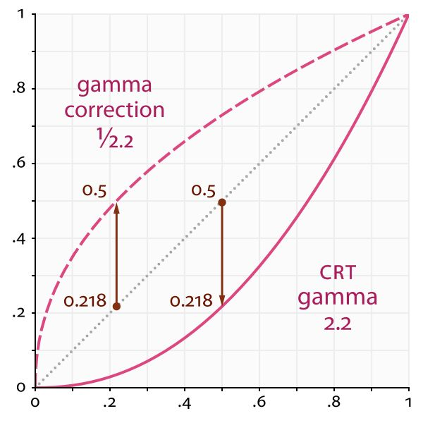

# gamma矫正
参考： 
1. https://zhuanlan.zhihu.com/p/36581276
2. https://blog.csdn.net/m0_57980287/article/details/117675703

## gamma的由来
Gamma 的由来，说法是不统一的。

部分人认为是由于早期 CRT 显示器的问题，即输出的亮度和输入的电压并非线性关系，而是近似 2.2 次幂的关系，导致进入人眼的亮度要比计算机上存储的亮度要低。例如，计算机上存储的亮度为 0.5，经过显示器调整后变为 0.5 的 2.2 次幂，即 0.218。为了让进入人眼的亮度与计算机中存储的值相同，需要在显示器调整前将亮度变为自身的 1/2.2 次幂，即 0.73，这样在经过显示器的调整，进入人眼就是 0.5 了，也就是说，Gamma 校正可以补偿由于显示器造成的亮度下降。这里需要注意的是，2.2 这个值是一个近似值，或者可以说是一个标准，实际上可能会有不同，现在的显示器甚至可以调节。

还有一种说法是，人眼对不同亮度的敏感程度是不同的，对暗部的敏感要高于亮部（这个是没错的）。而存储颜色的空间是有限的，例如常用的 RGBA32 格式，每个颜色通道都只有 8 位，只能存储 256 种亮度，所以基于人眼感知的原因，用更多的空间存储更多暗部的颜色是更合理的。人眼感知到的中间亮度值大概是 0.18，换算到 0.5 大约是 pow(0.18, 0.4042)，也就是说大约可以用 0.4042 这个指数（但是也有说通过人为测量，指数定到 0.45 的，这里不必纠结，因为本身就是近似值，每个人感知的也不一样），来计算亮度最终变换后的结果，以存储更多暗部的亮度值（后面会详细讲解为什么这么做可以存储更多暗部的亮度值）。当然显示的时候，依然需要把这个亮度再变换到幂运算之前的结果，以显然原本的颜色，不过实际上并不需要这么做，因为这里有一个美妙的巧合，那就是我们用来提高暗部存储范围的指数，恰好和测量出的显示器调整输出亮度的指数近似为倒数，也就是说，什么也不用做，显示出来的自然就是原本的颜色。

**举例**\
通常情况下，设计师制作好的图片一般都是基于自己观察到的，也就是基于物理世界的亮度值，因为有显示器调节降低亮度的缘故，实际上在计算机中存储的是观察到的亮度值的 0.45 次幂（以下 Gamma 值都算作 2.2， 1 / 2.2 约等于 0.45），因为物理世界是线性空间的，所以这种情况下计算机中存储的值就是 sRGB 空间。如果用 sRGB 空间的值计算光照，则光照算法实际上是有些问题的。

举个例子，设计师制作了一张亮度值为 0.5 的图（0.5 指的是计算机中存储的原图亮度，也就是 sRGB 空间），经过显示器调解后，亮度变为 0.218。这时如果使用名为“将亮度变为原来的 2 倍”的算法时，如果直接将计算机中的 0.5 乘上 2 ，即为 1，再经过显示器调解，输出出来的亮度值还是 1 （因为是 1 的 2.2 次幂）。从 0.218 到 1，亮度变为之前的 4 倍多，这并不是我们预期的（注意我并没有说这样的效果一定不好，只能说不是我们预期的）。所以我们需要先把计算机中的亮度值还原成线性空间的，也就是将 0.5 变换为线性空间的值 0.218，再乘 2 变为 0.436，此时依然是线性空间中。不过这时候不能直接输出，因为显示器会把 sRGB 的值变换到线性空间，如果计算机中存储的是线性空间的值，那么把线性空间的值再进行一次变换，就是错误的，所以我们需要再把 0.436 这个线性空间的值再重新变换到 sRGB 空间，即 pow(0.436, 0.45) 约等于 0.688，最后再经过显示器的调解后，变为 pow(0.688, 2.2) 约等于 0.439，这样观察到的物理世界亮度基本就是原来的 2 倍了（原来的物理世界中的亮度为 0.218）。

## 为什么需要gamma矫正

先看看颜色的来源

线性空间中的颜色 如果程序中获取到的颜色值是基于线性的，比如说手动输入了一些颜色值，那么想把这些颜色理想的显示出来，就要对他们进行Gamma校正，这样才能保证显示器在显示出来后是原来的颜色

非线性空间中的颜色 非线性的颜色指的是执行过Gamma分之一次方后的颜色，也就是已经执行过Gamma校正的颜色，如果程序获取到的是这种颜色，就不需要再进行Gamma校正，直接发送给显示器显示即可
非线性空间中的颜色从何而来？ 这是一个非常简单，但又非常值得细品的一个问题：

当你在电脑上绘制完一张理想的图片后，请你再回想一下给图片设置颜色的过程；无论在任何时候，你设置的颜色都是根据你在显示器前看到的颜色，这就意味着所有创作出来的图片的颜色都是被显示器执行过Gamma次方后的颜色，而这都是你理想中的颜色，那么你给图片所设置的颜色，不恰好正是最终显示出来颜色值的Gamma分之一次方？所以你在无意识中就做出了一张经过Gamma校正过的图片，而且可以肯定的是，几乎所有图片中的颜色都是经过Gamma校正过的

再总结一下：非线性空间中的颜色指的是经过Gamma校正的颜色，就是从创作出来的图片中读取的颜色，他们在一般情况下可以直接发送给显示器直接显示

那么问题来了：二班情况是什么？ 其实“一般情况”指的是：不需要对颜色值进行再次加工，比如说光照计算、混合等一些操作；那么“二班情况”当然就是要对颜色值进行再次加工了；比如说，当有两张图片需要混合时，就要先对他们各自进行Gamma次方计算，变换到线性空间中（变换成理想的颜色值），再进行混合，混合完之后再进行Gamma校正，最后发送给显示器显示

那么问题又来了：二班的情况为什么要变换到线性空间中？ 这个问题最后回答

还有一个问题：上面说“几乎”所有图片中的颜色都是经过Gamma校正过的，那么有什么图片不是？举个栗子：在基于物理的渲染中（PBR），为了高效的实现光照，常常会用到漫反射贴图、镜面光照贴图和法线贴图等一系列贴图，这里的镜面光照贴图和法线贴图通常都不是，他们用的是线性空间中的颜色
最后再再总结一下： 如果用线性空间中的颜色发送给显示器显示，在显示之前要进行Gamma校正；如果用非线性空间中的颜色，则可以直接发送给显示器显示；但是，如果要对非线性空间中颜色的图片进行加工，就要在加工前先进行Gamma次方计算，加工后再进行Gamma校正，之后才能发送给显示器显示

## gamma矫正转换公式

* sRGB to CIE XYZ:
$$
sRGB(x) = \begin{cases} 12.92 x,  &x\lt= 0.0031308 \\[2ex] 1.055 x ^ {1/2.4} - 0.055, &x\gt 0.0031308 \end{cases}
$$
$x$为线性空间中的颜色。

* CIE XYZ to sRGB:
$$
 linear(x) = \begin{cases} \frac {x} {12.9}, &x\lt= 0.04045 \\[2ex] (\frac{x + 0.055} {1.055}) ^ {2.4}, &x\gt 0.04045 \end{cases}\\[2ex] 
$$
$x$为sRGB空间中的颜色。

* rec.2020 to CIE XYZ:
* CIE XYZ to rec.2020

